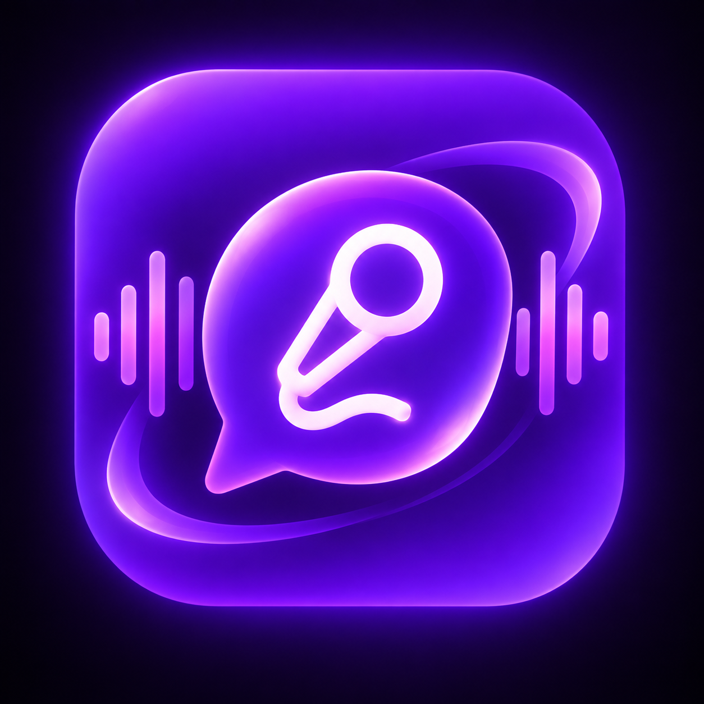
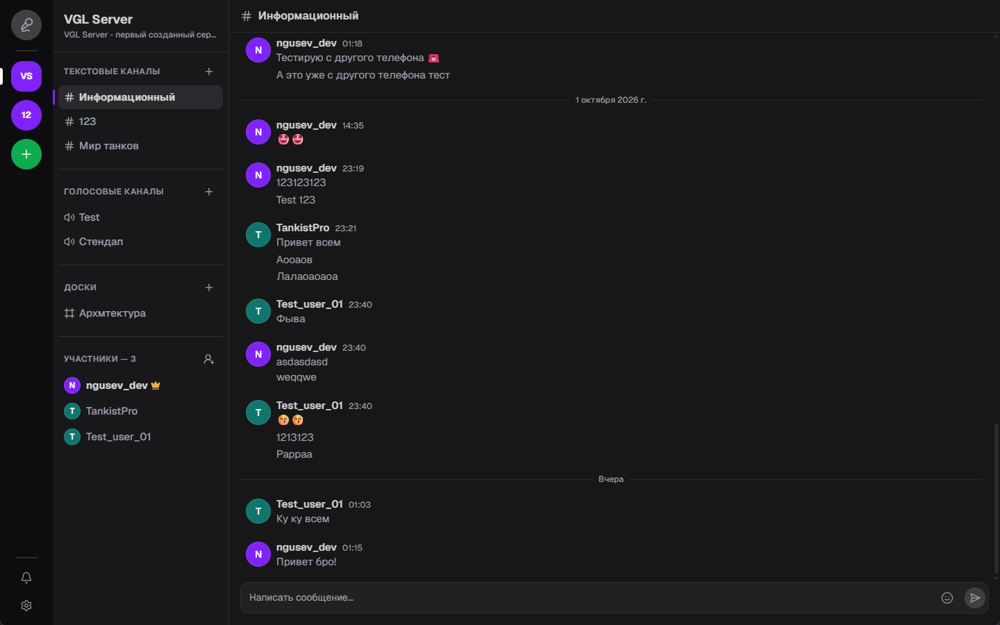
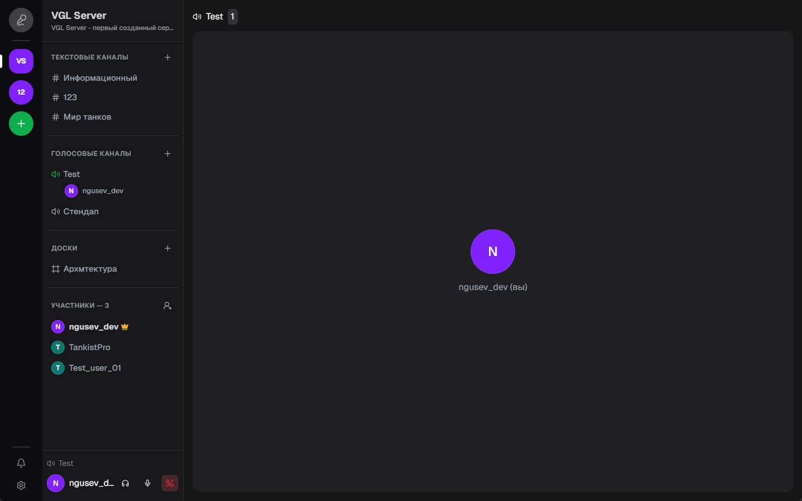
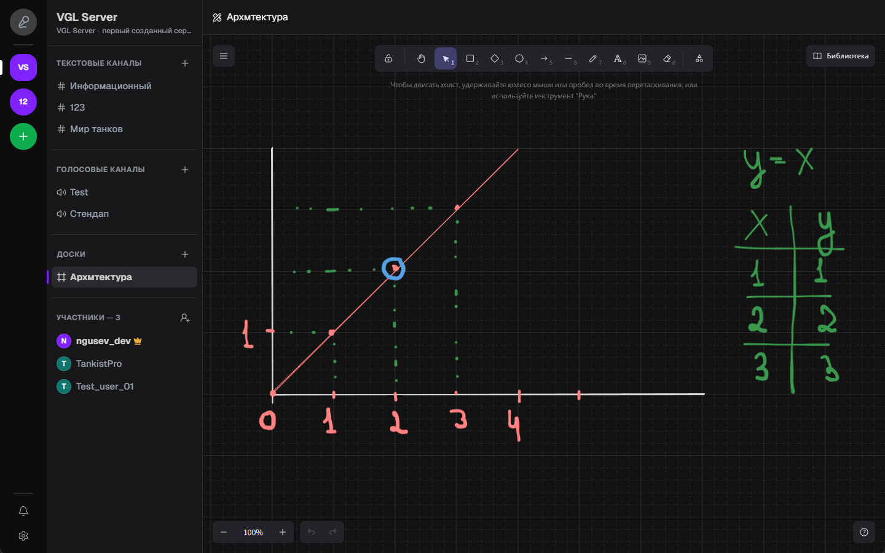
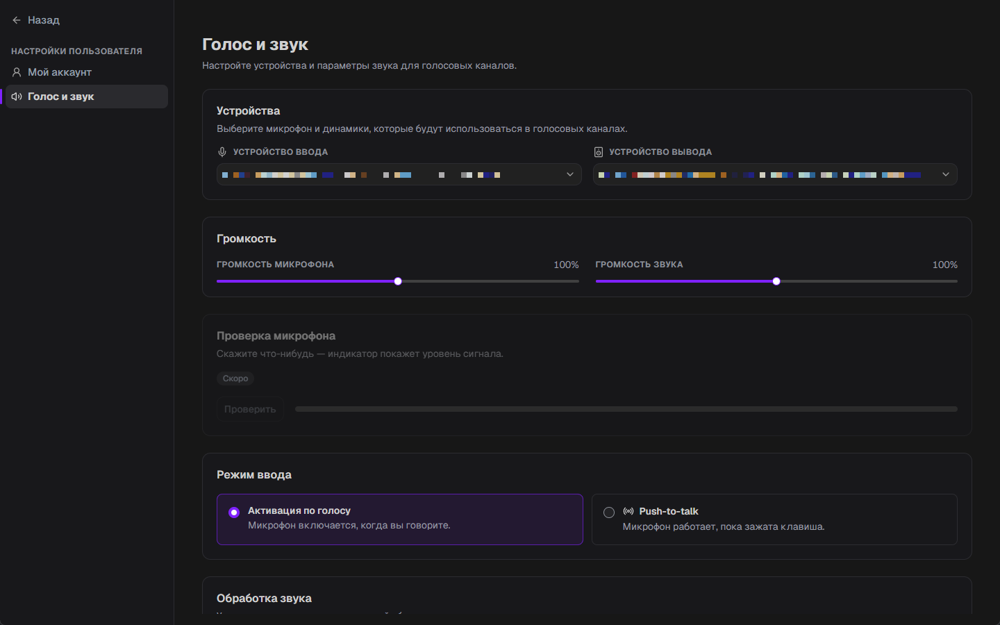

# VoiceChat

**Десктопный и мобильный мессенджер для команд и сообществ — серверы, текстовые и голосовые каналы, совместные доски.**

[Скачать](#-установка) · [Возможности](#-возможности) · [Скриншоты](#-скриншоты) · [Разработка](#-разработка)

## ✨ Возможности

- 🏰 **Серверы** — создавайте свои сообщества, приглашайте участников и управляйте составом.
- 💬 **Текстовые каналы** — сообщения в реальном времени, группировка по дням, эмодзи.
- 🎙️ **Голосовые каналы** — голосовая связь на базе [LiveKit](https://livekit.io/): видно, кто сейчас в канале, есть быстрые кнопки микрофона, звука и отключения.
- 🖌️ **Доски** — бесконечный холст на [Excalidraw](https://excalidraw.com/) прямо внутри сервера, для схем, набросков и мозговых штурмов.
- 🔔 **Уведомления** — приглашения и события приходят мгновенно через Centrifugo, плюс системные уведомления ОС.
- 🎧 **Настройки звука** — выбор микрофона и динамиков (запоминается между запусками), громкость.
- 🔐 **Безопасность** — токены хранятся не в браузере, а в Rust-части приложения: в системном хранилище ключей (Windows Credential Manager / macOS Keychain / Secret Service) или в файле, зашифрованном AES-256-GCM.
- 📱 **Мобильная версия** — адаптивный интерфейс и сборка под Android.

## 📸 Скриншоты

<table>
  <tr>
    <td width="50%">
      
      
<b>Голосовой канал</b> Участники на сцене и панель управления звонком

    </td>
    <td width="50%">
      
      
<b>Доски</b> Совместный холст на Excalidraw внутри сервера

    </td>
  </tr>
  <tr>
    <td width="50%">
      
      
<b>Текстовый чат</b> Сообщения в реальном времени с разделением по дням

    </td>
    <td width="50%">
      
      
<b>Голос и звук</b> Выбор устройств и громкость

    </td>
  </tr>
</table>

## 📦 Установка

Готовые сборки публикуются на странице [Releases](https://github.com/voice-chat-team/voice-chat-desktop/releases/latest):

| Платформа  | Файл                                                                                                                              |
| ---------- | --------------------------------------------------------------------------------------------------------------------------------- |
| 🪟 Windows | установщик `.msi` / `.exe`                                                                                                        |
| 🤖 Android | [`voice-chat-android.apk`](https://github.com/voice-chat-team/voice-chat-desktop/releases/latest/download/voice-chat-android.apk) |
